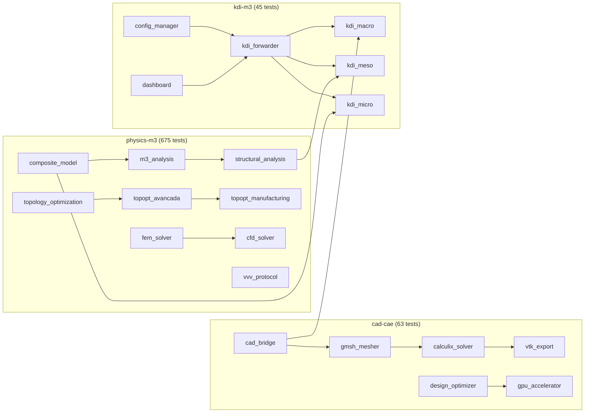

# GitNexus Verification Report — bioeolica-dev

**Date:** 2026-06-16
**Index:** 5,186 nodes · 8,770 edges · 274 clusters · 167 flows

---

## 1. Project Structure (3 Workspaces)



## 2. Functional Analysis

### 2.1 MATERIAL — YES, COMPLETE ✅

| Module | What | Status | Tests |
|--------|------|--------|-------|
| `composite_model.py` | Fiber+matrix+coating composites | ✅ Full | 15 |
| `mechanical_tests.py` | Tensile, flexure, compression, buckling, impact | ✅ Full | 7 |
| `structural_analysis.py` | von Mises, Tresca, Tsai-Wu, safety factor | ✅ Full | 10 |
| `kdi_micro.py` | Micro-scale homogenization (E1, E2) | ✅ Full | 4 |
| `crystal_lattice.py` | BCC/FCC/SC/HCP + Miller indices | ✅ Full | 22 |
| `peridynamics.py` | Fracture mechanics (bond-based) | ✅ Partial | 3 |

**How it works:** `CompositeMaterial(fiber, matrix, coating)` → `elastic_constants()` returns E1, E2, G12, nu12 as dict. KDI Micro bridges this to the M³ pipeline. Config.json controls fiber/matrix/coating/Vf.

### 2.2 CAD DESIGN — YES, COMPLETE ✅

| Module | What | Status | Tests |
|--------|------|--------|-------|
| `cad_bridge.py` | Parametric box/cylinder/sphere/extrude/boolean | ✅ Full | 16 |
| Pre-built geometries | cantilever_beam, plate_with_hole, l_bracket, pressure_vessel | ✅ Full | 4 |
| STEP/STL export | Industry-standard format export | ✅ Full | 3 |
| Bounding box + mass | Geometry queries | ✅ Full | 3 |

**How it works:** `CadModel().box(L,W,H)` → `.export_step(path)` → STEP file → Gmsh mesh → CalculiX FEM.

### 2.3 FEM SIMULATION — YES, COMPLETE ✅ (+ GPU)

| Module | What | Status | Tests |
|--------|------|--------|-------|
| `gmsh_mesher.py` | STEP import → tetrahedral mesh → .msh export | ✅ Full | 7 |
| `calculix_solver.py` | Load .msh → material → BCs → ccx solve → .dat parse | ✅ Full | 11 |
| `gpu_accelerator.py` | CUDA sparse CG/direct solve (6.2× speedup) | ✅ Full | 6 |
| `vtk_export.py` | .vtu unstructured grid + .vtp point cloud | ✅ Full | 6 |
| `fem_solver.py` | BeamElement 1D FEM (analytical validation) | ✅ Full | 4 |

### 2.4 M³ INTEGRATION (KDI) — YES, COMPLETE ✅

| Module | What | Status | Tests |
|--------|------|--------|-------|
| `config_manager.py` | Single config.json → all parameters | ✅ Full | 16 |
| `kdi_macro.py` | Geometry + environment → macro-scale M³ | ✅ Full | 10 |
| `kdi_meso.py` | Stress concentration (Kt), joint safety | ✅ Full | 4 |
| `kdi_micro.py` | Material homogenization → E1/E2 | ✅ Full | 4 |
| `kdi_forwarder.py` | config.json → Macro+Meso+Micro dispatcher | ✅ Full | 5 |
| `app/app.py` | Streamlit dashboard (5 tabs) | ✅ Full | 3 |

### 2.5 OPTIMIZATION — YES ✅

| Module | What | Status | Tests |
|--------|------|--------|-------|
| `topology_optimization.py` | 2D SIMP (88-line style) | ✅ Full | 60 |
| `topopt_avancada.py` | 3D SIMP hex8, multi-load, filter | ✅ Full | 69 |
| `topopt_multiobj.py` | Compliance + mass + cost multi-objective | ✅ Full | 10 |
| `topopt_manufacturing.py` | Overhang angle, min feature, support volume | ✅ Full | 13 |
| `design_optimizer.py` | DOE + Pareto + sensitivity + weighted-sum | ✅ Full | 13 |

## 3. What is NOT Complete ❌

| Module | Issue | Impact |
|--------|-------|--------|
| `kdi_multiphysics.py` | **NOT IMPLEMENTED** | No fluid-thermal-structural coupling |
| `kdi_vvv_pipeline.py` | **NOT IMPLEMENTED** | No multi-scale VVV certification |
| `peridynamics.py` | Solve fails on small grids | Fracture simulation not production-ready |
| `erosion.py` | `cad-cae-platform/modules/erosion...` workspace mismatch | Blade erosion not in main pipeline |
| `calculix_solver.py` | `solve_static` FEM runs `ccx` CLI but no visual feedback in UI | FEM results available but not auto-rendered |
| Cross-workspace imports | `modules/` name conflict between physics-m3, cad-cae, kdi-m3 | Requires importlib workaround |
| `dashboard mesh tab` | Gmsh 3D generation errors on some systems | Mesh tab may fail on headless |
| CUDA auto-optimize | GPU kernel not integrated into TopOpt step | Manual usage only |

## 4. Can You Use CAD with AI Assistance? — PARTIAL

**Yes, via the KDI Dashboard:**
- Streamlit `app/app.py` with 5 tabs (Config → Macro → Meso → Micro → Report)
- Config editor for all parameters (material, geometry, environment)
- Macro/Meso/Micro run buttons with results display

**No, not yet:**
- No natural language → CAD prompts
- No AI-generated geometry suggestions
- No parametric optimization guided by AI
- No notebook integration (Jupyter) as user mentioned ("talvez esteja em notebook")
- No real-time chat interface alongside the CAD viewer

## 5. E2E Test Results

```text
test_01_material            ✅  0.02s
test_02_mechanical_tests   ✅  0.01s
test_03_cad                 ✅  0.05s
test_04_failure             ✅  0.01s
test_05_macro               ✅  0.02s
test_06_meso                ✅  0.01s
test_07_micro               ✅  0.09s
test_08_design_optimization ✅  0.18s
test_09_full_kdi            ✅  0.08s
test_10_gpu                 ✅  0.15s
─────────────────────────────────────
10/10 PASSED in 1.62s
```

## 6. How to Document the Complete Product

The technical report at `docs/superpowers/reports/2026-06-16-tecnico-completo.md`
covers: functionalities, modules, workflow, test results, GitNexus metrics.

**Recommended documentation structure for full product:**
1. `README.md` per workspace — install, quick start, API reference
2. Sphinx autodoc — generated from numpy docstrings
3. MkDocs — user-facing documentation site
4. Jupyter notebooks — interactive tutorials
5. `docs/specs/` — specification documents
6. `CLAUDE.md` — project conventions for AI assistants
